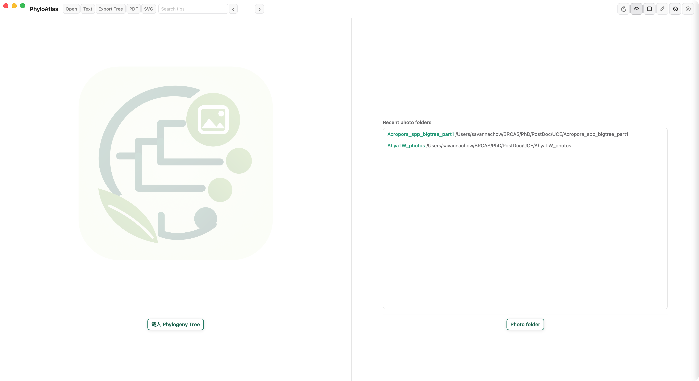
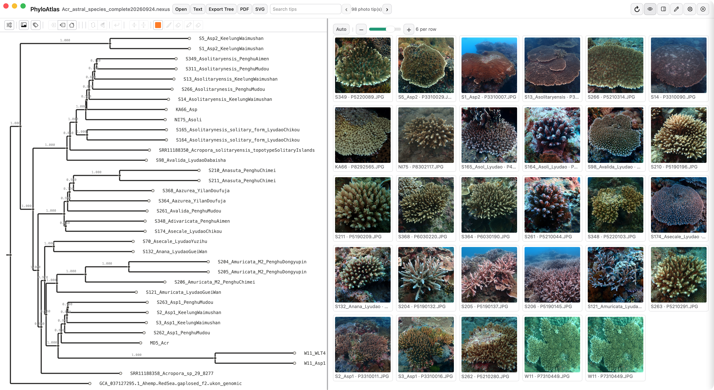
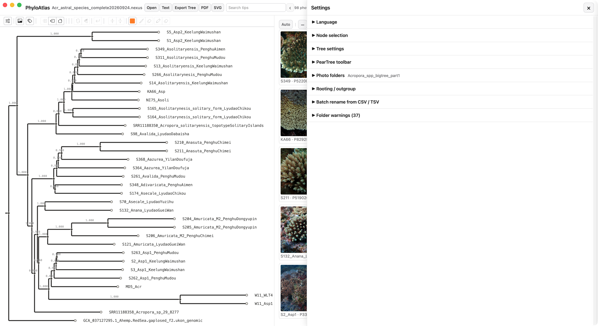
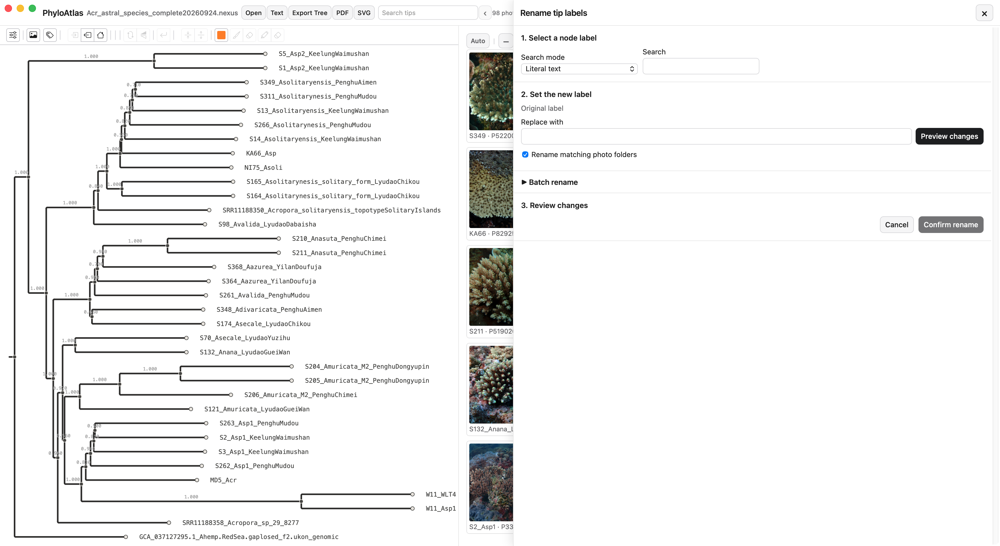

# PhyloAtlas 使用說明

PhyloAtlas 是一個給本機資料使用的 phylogeny tree 與照片瀏覽工具。

我最初是因為研究珊瑚（Acropora）族群的遺傳與演化而開發它。珊瑚的形態、物種與演化關係往往不容易區分；形態多樣性也使樣本之間的親緣關係、物種分界與形態辨識變得困難。PhyloAtlas 讓研究者可以把 phylogeny tree 與樣本照片放在同一個畫面中比較。

它不限於珊瑚。只要有照片、phylogeny tree（`.tree`、`.treefile`、Newick 或 `.nexus` 等格式），並且有適當的 node 命名規則，就可以用來整理與比較不同樣本。

## 主要功能

- 讀取 phylogeny tree，使用 PearTree 顯示與操作樹。
- 依照 node 名稱規則尋找對應的照片資料夾。
- 為尚未存在的 tree node 建立資料夾；既有資料夾不會覆蓋，舊樣本也不會刪除。
- 在 tree 與照片之間同步瀏覽，支援單一 node 或 clade 的照片檢視。
- 從每個 node 的照片中勾選一張或多張代表照。
- 以 grid 檢視多個 node 的代表照，可用滑桿、加減按鈕或觸控板 pinch 調整每列照片數。
- 搜尋 tree node、上一個／下一個瀏覽結果，以及鍵盤方向鍵切換有照片的末端節點。
- 重新命名 node，支援搜尋取代、正規表示式與 CSV／TSV identifier 批次更名。
- 可同步更新相對應的照片資料夾名稱。
- 匯出 Tree、PDF 與可編輯 SVG。
- Tree 與照片都在本機處理，不需要另外啟動 Python 或連線到 NAS server。

## 開始使用

1. 按左側的「載入 Phylogeny Tree」，選擇 `.tree`、`.treefile`、Newick 或 `.nexus` 檔案。
2. 按右側的「照片資料夾」，選擇包含 node 對應資料夾的照片根目錄。
3. 如果 tree 與照片資料夾都已載入，點選 tree 中的 node 或 clade，即可在右側查看照片。
4. 第一次使用新的 tree 時，可在「設定 → 節點選取」按「建立樹末端節點資料夾」。程式只建立缺少的資料夾，不會覆蓋既有資料夾，也不會刪除舊資料夾。

## 上方操作列

| 操作 | 說明 |
| --- | --- |
| 開啟預設程式 | 使用 macOS 對該檔案副檔名設定的預設程式開啟目前 tree。 |
| 開啟純文字 | 使用純文字編輯器開啟目前 tree 檔案。 |
| 匯出 Tree | 開啟 PearTree 的原生 Tree 匯出功能。可選 NEXUS 或 Newick 等格式與 Tree 設定。 |
| PDF | 將目前 tree 與照片面板輸出成 PDF，並可指定輸出尺寸。 |
| SVG | 開啟 PearTree 的圖像匯出功能，輸出可在 Illustrator 等軟體中繼續編輯的 SVG。 |
| 搜尋末端節點 | 搜尋 tree 中的 tip label；左右箭頭可切換搜尋結果。 |
| 重新讀取照片資料夾 | 重新掃描已載入的照片根目錄，適合新增照片後使用。 |
| 顯示／隱藏 PearTree 工具列 | 隱藏或顯示左側 PearTree 工具列與右側照片標題控制列。 |
| 顯示／隱藏照片面板 | 展開或收起右側照片面板。 |
| 重新命名 | 開啟 node 名稱搜尋、取代與預覽面板。 |
| 設定 | 開啟設定面板。 |
| 關閉 | 關閉目前 tree 與照片資料夾，回到初始選擇畫面。 |

## 設定面板

### 語言

可選擇系統預設、English、繁體中文或日本語。選擇「系統預設」時，PhyloAtlas 會依 macOS 語言設定選擇介面語言。

### 節點選取

可搜尋並選取 tree node，查看該 node 的照片，也可以建立缺少的 node 資料夾。選取標記樣式可調整文字顏色、字體、末端節點標記與內部節點標記；變更後會自動重新載入目前 tree，不需要重新啟動 App。

### Tree 設定

可選擇原始、比例或等長的 branch display，也可以儲存或重設 PearTree 的顯示設定。

### PearTree 工具列

以分類及個別項目的方式控制 PearTree 工具列。可以分別顯示或隱藏檔案與匯出、標註、導覽、縮放、排序、旋轉、定根、顏色、篩選與面板等功能；定根功能內的小項目也可以單獨選擇。按「套用工具列」後會重新載入左側 Tree 面板。

### 照片資料夾

設定 node 對應照片資料夾的規則：

- 完整末端節點名稱：整個 node label 對應資料夾名稱。
- 前導欄位：依分隔符號取得前幾個欄位。例如 `S14_Asolitaryensis_KeelungWaimushan` 使用 `_` 與第一個欄位時，鍵值是 `S14`。
- 正規表示式：使用自訂 Regex 取得資料夾鍵值。
- 可設定是否區分大小寫，以及是否在捲動時載入照片。

建立 node 資料夾時會使用同一套規則，確保建立的資料夾與日後的照片 matching 一致。

### 定根 / 外群

可恢復原始 root、選擇單一外群、選擇多個外群並使用 MRCA，或使用 midpoint root。外群可透過 node 名稱搜尋。

### 匯入 CSV 批次更名

選擇兩欄 CSV／TSV：第一欄是 identifier，第二欄是 delimiter 後要更新的文字。程式會先顯示目前名稱、更新後名稱與照片資料夾，再由使用者確認。這個功能使用完整名稱比對，不會把 `S1` 誤改成 `S11`。

### 資料夾警告

顯示找不到、重複或有多個候選資料夾的 node，協助修正命名規則或照片資料夾結構。

## 代表照與照片 grid

在單一 node 的照片中勾選代表照。選取多個 node 或 clade 時，右側會顯示這些 node 已選取的代表照。照片排列控制位於照片標題列：

- 「最佳化」會依目前面板大小與照片數量，選擇能完整呈現且照片盡量大的排列。
- `−`、滑桿與 `+` 控制每列照片數；照片超出高度時會在同一個照片區域內向下捲動。
- 觸控板 pinch out 會讓照片變大、減少每列照片數；pinch in 會讓照片變小、增加每列照片數。
- 點照片可進入沉浸式檢視；雙擊可使用系統預設程式開啟照片。

## 截圖

### 初始畫面

### Tree 與照片比較

### 設定面板

### Node 更名

